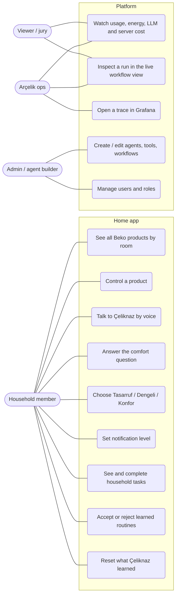

# 01 — Use cases

```mermaid
flowchart LR
  M([Household member])
  O([Arçelik ops])
  A([Admin / agent builder])
  V([Viewer / jury])

  subgraph Home["Home app"]
    U1(See all Beko products by room)
    U2(Control a product)
    U3(Talk to Çeliknaz by voice)
    U4(Answer the comfort question)
    U5(Choose Tasarruf / Dengeli / Konfor)
    U6(Set notification level)
    U7(See and complete household tasks)
    U8(Accept or reject learned routines)
    U9(Reset what Çeliknaz learned)
  end
  subgraph Platform["Platform"]
    P1(Watch usage, energy, LLM and server cost)
    P2(Inspect a run in the live workflow view)
    P3(Open a trace in Grafana)
    P4(Create / edit agents, tools, workflows)
    P5(Manage users and roles)
  end

  M --- U1 & U2 & U3 & U4 & U5 & U6 & U7 & U8 & U9
  O --- P1 & P2 & P3
  V --- P1 & P2
  A --- P4 & P5
```
