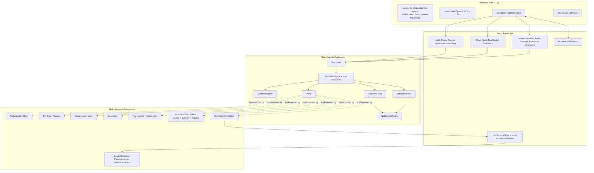

# 02 — Components

```mermaid
flowchart TB
  subgraph FE["frontend (Vite + TS)"]
    F1[pages: ev, cihaz, görevler, ayarlar,<br/>sohbet, akış, panel, ajanlar, kullanıcılar]
    F2[voice: Web Speech STT + TTS]
    F3[api client + SignalR client]
    F4[tokens.css, i18n/tr.ts]
  end

  subgraph API["Beko.Agents.Api"]
    A1[Auth, Users, Agents, Workflows controllers]
    A2[Chat, Runs, Dashboard controllers]
    A3[Homes, Devices, Tasks, Settings, Feedback controllers]
    A4[Mock HomeWhiz + mock location controllers]
    A5[RunHub, DeviceHub]
  end

  subgraph APP["Beko.Agents.Application"]
    B1[WorkflowEngine + step executors]
    B2[Use cases]
    B3[ComfortEngine]
    B4[DecisionPolicy]
    B5[TaskDistributor]
    B6[NotificationPolicy]
    B7[Ports]
  end

  subgraph INF["Beko.Agents.Infrastructure"]
    C1[AnthropicLlmClient]
    C2[EF Core / Npgsql]
    C3[Mongo event store]
    C4[Guardrails]
    C5[Tool registry + home tools]
    C6[RunEventSink: span + Mongo + SignalR + metrics]
    C7[HomeWhizHttpClient]
    C8[DeviceSimulator, PatternLearner, PresenceService]
  end

  F3 --> A1 & A2 & A3
  F3 <--> A5
  A1 & A2 & A3 --> B2
  B2 --> B1 --> B7
  B1 --> B3 & B4 & B5
  B4 & B5 --> B6
  B7 -.implemented by.-> C1 & C2 & C3 & C4 & C5 & C6 & C7
  C7 --> A4
  A4 --> C8
```
