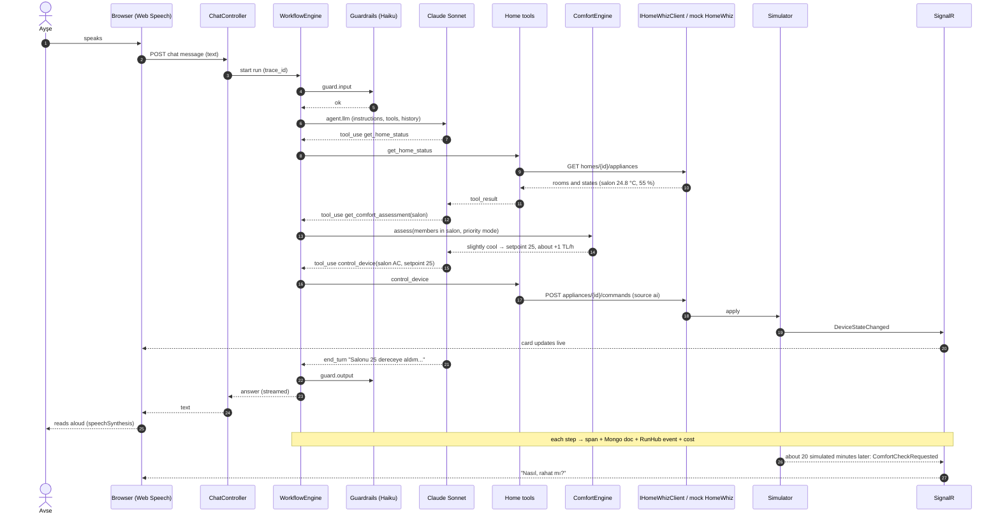

# 03 — Agent run: "Ev soğudu, biraz ısıt"

Every step on the backend side runs inside the step wrapper: OTel span + Mongo document + SignalR event + metrics.

```mermaid
sequenceDiagram
  autonumber
  actor U as Ayşe
  participant B as Browser (Web Speech)
  participant API as ChatController
  participant WE as WorkflowEngine
  participant G as Guardrails (Haiku)
  participant L as Claude Sonnet
  participant T as Home tools
  participant CE as ComfortEngine
  participant HW as IHomeWhizClient / mock HomeWhiz
  participant S as Simulator
  participant H as SignalR

  U->>B: speaks
  B->>API: POST chat message (text)
  API->>WE: start run (trace_id)
  WE->>G: guard.input
  G-->>WE: ok
  WE->>L: agent.llm (instructions, tools, history)
  L-->>WE: tool_use get_home_status
  WE->>T: get_home_status
  T->>HW: GET homes/{id}/appliances
  HW-->>T: rooms and states (salon 24.8 °C, 55 %)
  T-->>L: tool_result
  L-->>WE: tool_use get_comfort_assessment(salon)
  WE->>CE: assess(members in salon, priority mode)
  CE-->>L: slightly cool → setpoint 25, about +1 TL/h
  L-->>WE: tool_use control_device(salon AC, setpoint 25)
  WE->>T: control_device
  T->>HW: POST appliances/{id}/commands (source ai)
  HW->>S: apply
  S->>H: DeviceStateChanged
  H-->>B: card updates live
  L-->>WE: end_turn "Salonu 25 dereceye aldım..."
  WE->>G: guard.output
  WE-->>API: answer (streamed)
  API-->>B: text
  B-->>U: reads aloud (speechSynthesis)
  Note over WE,H: each step → span + Mongo doc + RunHub event + cost
  S-->>H: about 20 simulated minutes later: ComfortCheckRequested
  H-->>B: "Nasıl, rahat mı?"
```
