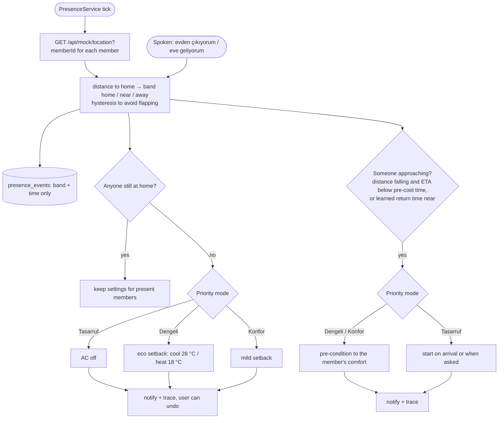

# 05 — Presence: leave range, setback, return

```mermaid
flowchart TD
  Start([PresenceService tick]) --> Get[GET /api/mock/location?memberId for each member]
  Get --> Dist[distance to home → band home / near / away<br/>hysteresis to avoid flapping]
  Spoken([Spoken: evden çıkıyorum / eve geliyorum]) --> Dist
  Dist --> Store[(presence_events: band + time only)]
  Dist --> Anyone{Anyone still at home?}
  Anyone -- yes --> Keep[keep settings for present members]
  Anyone -- no --> Mode{Priority mode}
  Mode -- Tasarruf --> Off[AC off]
  Mode -- Dengeli --> Eco[eco setback: cool 28 °C / heat 18 °C]
  Mode -- Konfor --> Mild[mild setback]
  Off & Eco & Mild --> N1[notify + trace, user can undo]

  Dist --> Back{Someone approaching?<br/>distance falling and ETA below pre-cool time,<br/>or learned return time near}
  Back -- yes --> PMode{Priority mode}
  PMode -- Dengeli / Konfor --> Pre[pre-condition to the member's comfort]
  PMode -- Tasarruf --> Arrive[start on arrival or when asked]
  Pre & Arrive --> N2[notify + trace]
```

Demo control: `PUT /api/mock/location/{memberId}/route` switches a member between `at_home`, `commute_out` and `commute_back`.
