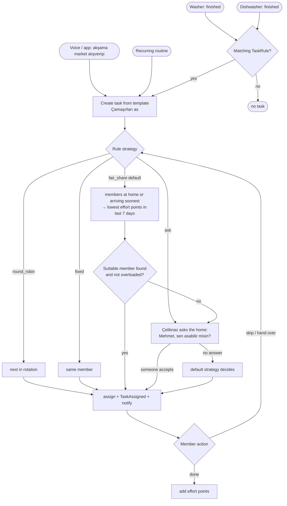
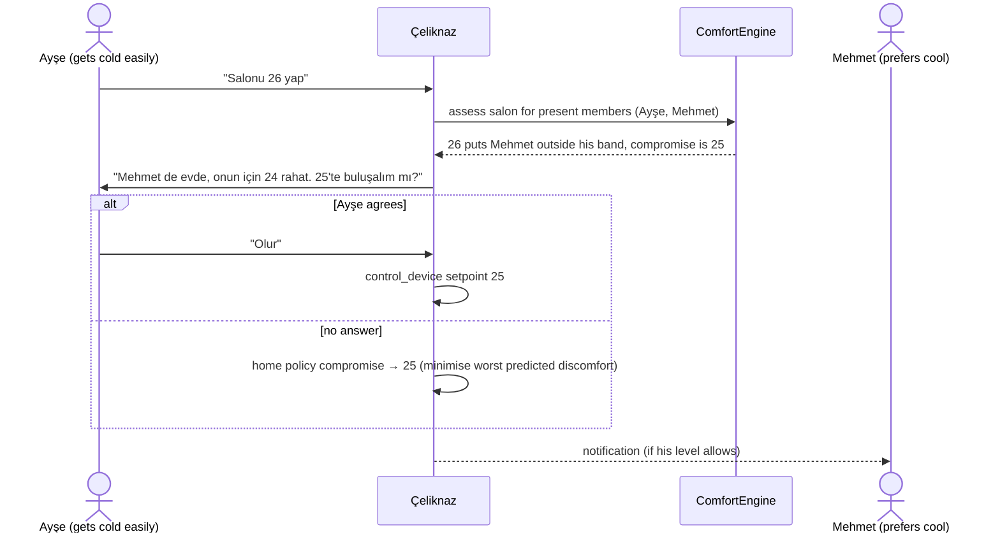

# 06 — Household tasks and comfort conflicts

## Task creation and distribution

```mermaid
flowchart TD
  E1([Washer: finished]) --> R
  E2([Dishwasher: finished]) --> R
  E3([Voice / app: akşama market alışverişi]) --> New
  E4([Recurring routine]) --> New
  R{Matching TaskRule?} -- yes --> New[Create task from template<br/>Çamaşırları as]
  R -- no --> Ignore([no task])
  New --> Strat{Rule strategy}
  Strat -- fair_share default --> Fair[members at home or arriving soonest<br/>→ lowest effort points in last 7 days]
  Strat -- round_robin --> RR[next in rotation]
  Strat -- fixed --> Fix[same member]
  Strat -- ask --> Ask
  Fair --> Ok{Suitable member found<br/>and not overloaded?}
  RR --> Assign
  Fix --> Assign
  Ok -- yes --> Assign[assign + TaskAssigned + notify]
  Ok -- no --> Ask[Çeliknaz asks the home:<br/>Mehmet, sen asabilir misin?]
  Ask -- someone accepts --> Assign
  Ask -- no answer --> Default[default strategy decides] --> Assign
  Assign --> Done{Member action}
  Done -- done --> Pts[add effort points]
  Done -- skip / hand over --> Strat
```

## Comfort conflict between members

```mermaid
sequenceDiagram
  actor A as Ayşe (gets cold easily)
  participant C as Çeliknaz
  participant CE as ComfortEngine
  actor M as Mehmet (prefers cool)
  A->>C: "Salonu 26 yap"
  C->>CE: assess salon for present members (Ayşe, Mehmet)
  CE-->>C: 26 puts Mehmet outside his band, compromise is 25
  C->>A: "Mehmet de evde, onun için 24 rahat. 25'te buluşalım mı?"
  alt Ayşe agrees
    A->>C: "Olur"
    C->>C: control_device setpoint 25
  else no answer
    C->>C: home policy compromise → 25 (minimise worst predicted discomfort)
  end
  C-->>M: notification (if his level allows)
```
