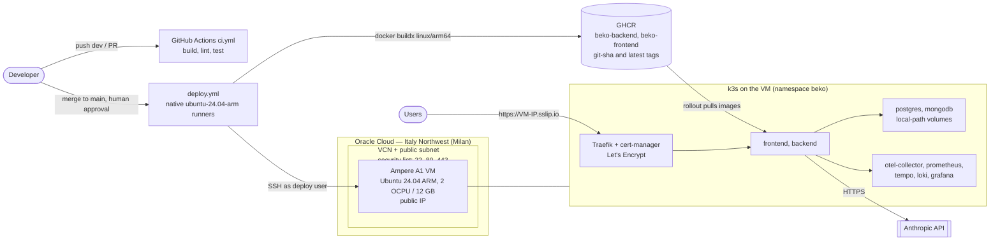

# 07 — Deployment

```mermaid
flowchart LR
  Dev([Developer]) -->|push dev / PR| CI[GitHub Actions ci.yml<br/>build, lint, test]
  Dev -->|merge to main, human approval| CD[deploy.yml<br/>native ubuntu-24.04-arm runners]
  CD -->|docker buildx linux/arm64| GHCR[(GHCR<br/>beko-backend, beko-frontend<br/>git-sha and latest tags)]
  CD -->|SSH as deploy user| VM

  subgraph OCI["Oracle Cloud — Italy Northwest (Milan)"]
    subgraph VCN["VCN + public subnet<br/>security list: 22, 80, 443"]
      VM["Ampere A1 VM<br/>Ubuntu 24.04 ARM, 2 OCPU / 12 GB<br/>public IP"]
    end
  end

  subgraph K3S["k3s on the VM (namespace beko)"]
    TR[Traefik + cert-manager<br/>Let's Encrypt]
    APP[frontend, backend]
    DATA[postgres, mongodb<br/>local-path volumes]
    OBS[otel-collector, prometheus,<br/>tempo, loki, grafana]
  end
  VM --- K3S
  GHCR -->|rollout pulls images| APP

  Users([Users]) -->|"https://VM-IP.sslip.io"| TR
  TR --> APP
  APP --> DATA & OBS
  APP -->|HTTPS| Anth[[Anthropic API]]
```

Secrets (`ANTHROPIC_API_KEY`, `JWT_SIGNING_KEY`, DB passwords, `DEPLOY_SSH_KEY`, `DEPLOY_HOST`, `DEPLOY_USER`) live in GitHub secrets and k8s secrets, never in git.
