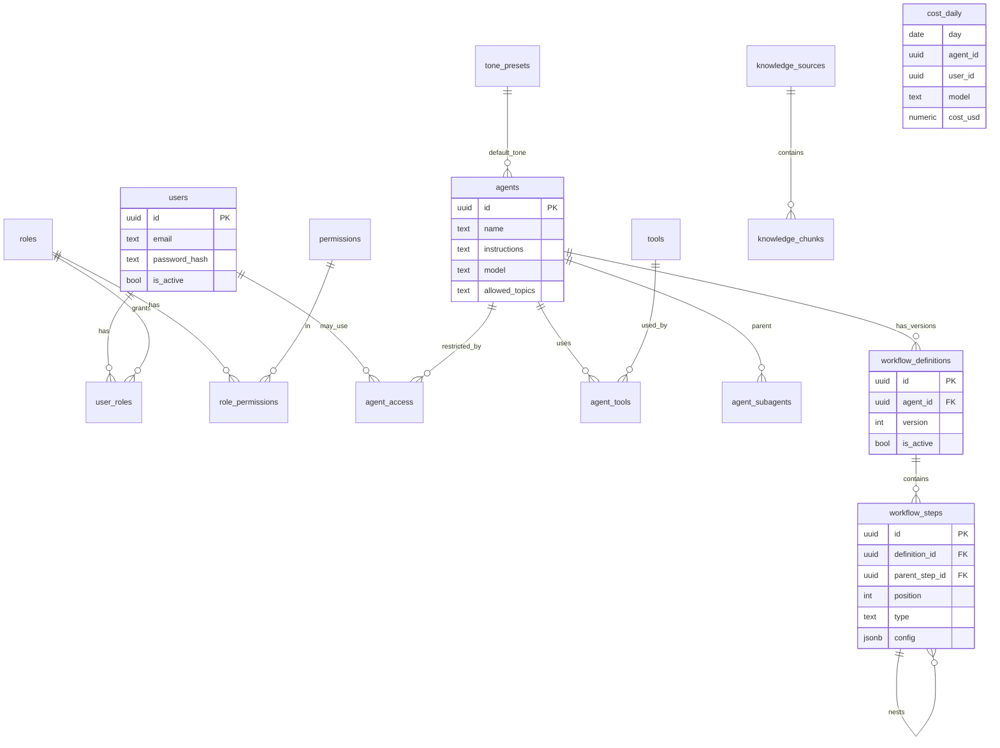
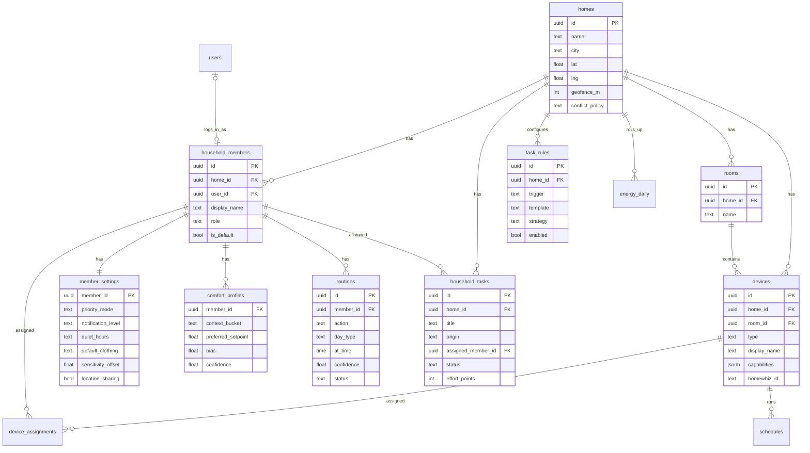

# 08 — PostgreSQL model

## Platform

```mermaid
erDiagram
  users ||--o{ user_roles : has
  roles ||--o{ user_roles : grants
  roles ||--o{ role_permissions : has
  permissions ||--o{ role_permissions : in
  users ||--o{ agent_access : may_use
  agents ||--o{ agent_access : restricted_by
  agents ||--o{ agent_tools : uses
  tools ||--o{ agent_tools : used_by
  agents ||--o{ agent_subagents : parent
  agents ||--o{ workflow_definitions : has_versions
  workflow_definitions ||--o{ workflow_steps : contains
  workflow_steps ||--o{ workflow_steps : nests
  tone_presets ||--o{ agents : default_tone
  knowledge_sources ||--o{ knowledge_chunks : contains

  users {
    uuid id PK
    text email
    text password_hash
    bool is_active
  }
  agents {
    uuid id PK
    text name
    text instructions
    text model
    text allowed_topics
  }
  workflow_definitions {
    uuid id PK
    uuid agent_id FK
    int version
    bool is_active
  }
  workflow_steps {
    uuid id PK
    uuid definition_id FK
    uuid parent_step_id FK
    int position
    text type
    jsonb config
  }
  cost_daily {
    date day
    uuid agent_id
    uuid user_id
    text model
    numeric cost_usd
  }
```

## Home domain (Çeliknaz)

```mermaid
erDiagram
  homes ||--o{ rooms : has
  homes ||--o{ household_members : has
  homes ||--o{ devices : has
  rooms ||--o{ devices : contains
  users |o--o| household_members : logs_in_as
  household_members ||--|| member_settings : has
  household_members ||--o{ comfort_profiles : has
  household_members ||--o{ routines : has
  devices ||--o{ device_assignments : assigned
  household_members ||--o{ device_assignments : assigned
  homes ||--o{ task_rules : configures
  homes ||--o{ household_tasks : has
  household_members ||--o{ household_tasks : assigned
  devices ||--o{ schedules : runs
  homes ||--o{ energy_daily : rolls_up

  homes {
    uuid id PK
    text name
    text city
    float lat
    float lng
    int geofence_m
    text conflict_policy
  }
  rooms {
    uuid id PK
    uuid home_id FK
    text name
  }
  household_members {
    uuid id PK
    uuid home_id FK
    uuid user_id FK
    text display_name
    text role
    bool is_default
  }
  devices {
    uuid id PK
    uuid home_id FK
    uuid room_id FK
    text type
    text display_name
    jsonb capabilities
    text homewhiz_id
  }
  member_settings {
    uuid member_id PK
    text priority_mode
    text notification_level
    text quiet_hours
    text default_clothing
    float sensitivity_offset
    bool location_sharing
  }
  comfort_profiles {
    uuid member_id FK
    text context_bucket
    float preferred_setpoint
    float bias
    float confidence
  }
  routines {
    uuid id PK
    uuid member_id FK
    text action
    text day_type
    time at_time
    float confidence
    text status
  }
  task_rules {
    uuid id PK
    uuid home_id FK
    text trigger
    text template
    text strategy
    bool enabled
  }
  household_tasks {
    uuid id PK
    uuid home_id FK
    text title
    text origin
    uuid assigned_member_id FK
    text status
    int effort_points
  }
```
