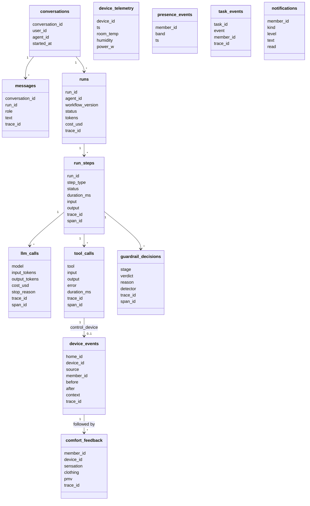

# 09 — MongoDB document model

Every document produced inside a run carries `trace_id` and `span_id`, so the dashboard can jump to the trace in Grafana.

```mermaid
classDiagram
  class conversations {
    conversation_id
    user_id
    agent_id
    started_at
  }
  class messages {
    conversation_id
    run_id
    role
    text
    trace_id
  }
  class runs {
    run_id
    agent_id
    workflow_version
    status
    tokens
    cost_usd
    trace_id
  }
  class run_steps {
    run_id
    step_type
    status
    duration_ms
    input
    output
    trace_id
    span_id
  }
  class llm_calls {
    model
    input_tokens
    output_tokens
    cost_usd
    stop_reason
    trace_id
    span_id
  }
  class tool_calls {
    tool
    input
    output
    error
    duration_ms
    trace_id
    span_id
  }
  class guardrail_decisions {
    stage
    verdict
    reason
    detector
    trace_id
    span_id
  }
  class device_events {
    home_id
    device_id
    source
    member_id
    before
    after
    context
    trace_id
  }
  class device_telemetry {
    device_id
    ts
    room_temp
    humidity
    power_w
  }
  class comfort_feedback {
    member_id
    device_id
    sensation
    clothing
    pmv
    trace_id
  }
  class presence_events {
    member_id
    band
    ts
  }
  class task_events {
    task_id
    event
    member_id
    trace_id
  }
  class notifications {
    member_id
    kind
    level
    text
    read
  }

  conversations "1" --> "*" messages
  conversations "1" --> "*" runs
  runs "1" --> "*" run_steps
  run_steps "1" --> "*" llm_calls
  run_steps "1" --> "*" tool_calls
  run_steps "1" --> "*" guardrail_decisions
  tool_calls "1" --> "0..1" device_events : control_device
  device_events "1" --> "*" comfort_feedback : followed by
```
