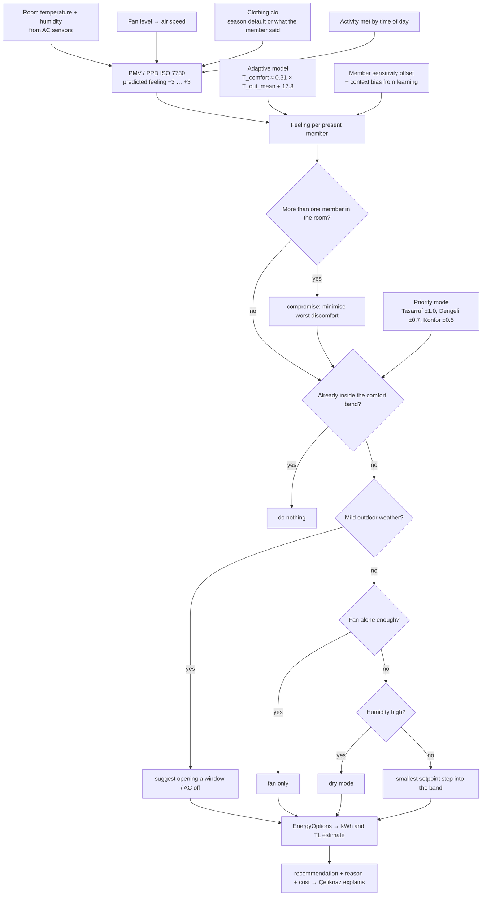

# 10 — Comfort decision

```mermaid
flowchart TD
  In1[Room temperature + humidity<br/>from AC sensors] --> PMV
  In2[Fan level → air speed] --> PMV
  In3[Clothing clo<br/>season default or what the member said] --> PMV
  In4[Activity met by time of day] --> PMV
  PMV[PMV / PPD ISO 7730<br/>predicted feeling −3 … +3] --> Adj
  Season[Adaptive model<br/>T_comfort ≈ 0.31 × T_out_mean + 17.8] --> Adj
  Bias[Member sensitivity offset<br/>+ context bias from learning] --> Adj
  Adj[Feeling per present member] --> Multi{More than one member in the room?}
  Multi -- yes --> Comp[compromise: minimise worst discomfort]
  Multi -- no --> Band
  Comp --> Band
  Mode[Priority mode<br/>Tasarruf ±1.0, Dengeli ±0.7, Konfor ±0.5] --> Band
  Band{Already inside the comfort band?}
  Band -- yes --> Nothing[do nothing]
  Band -- no --> A1{Mild outdoor weather?}
  A1 -- yes --> W[suggest opening a window / AC off]
  A1 -- no --> A2{Fan alone enough?}
  A2 -- yes --> F[fan only]
  A2 -- no --> A3{Humidity high?}
  A3 -- yes --> D[dry mode]
  A3 -- no --> SP[smallest setpoint step into the band]
  W & F & D & SP --> Cost[EnergyOptions → kWh and TL estimate]
  Cost --> Out[recommendation + reason + cost → Çeliknaz explains]
```

For the washer and dishwasher the same priority mode drives **cheap-hour shifting**: `find_cheapest_time` picks the cheapest tariff band before the user's deadline.
