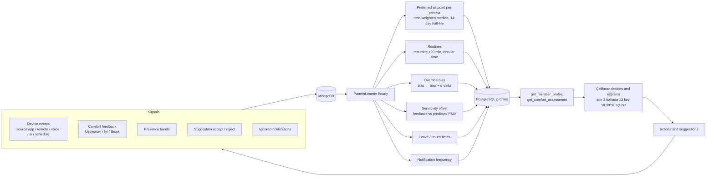

# 11 — Learning loop

```mermaid
flowchart LR
  subgraph Signals
    S1[Device events<br/>source app / remote / voice / ai / schedule]
    S2[Comfort feedback<br/>Üşüyorum / İyi / Sıcak]
    S3[Presence bands]
    S4[Suggestion accept / reject]
    S5[Ignored notifications]
  end
  Signals --> M[(MongoDB)]
  M --> PL[PatternLearner hourly]
  PL --> P1[Preferred setpoint per context<br/>time-weighted median, 14-day half-life]
  PL --> P2[Routines<br/>recurring ±20 min, circular time]
  PL --> P3[Override bias<br/>bias ← bias + α·delta]
  PL --> P4[Sensitivity offset<br/>feedback vs predicted PMV]
  PL --> P5[Leave / return times]
  PL --> P6[Notification frequency]
  P1 & P2 & P3 & P4 & P5 & P6 --> PG[(PostgreSQL profiles)]
  PG --> Tools[get_member_profile,<br/>get_comfort_assessment]
  Tools --> C[Çeliknaz decides and explains<br/>son 3 haftada 13 kez 18:30'da açtınız]
  C --> Act[actions and suggestions]
  Act --> Signals
```

Measured for the jury: the override rate falls, the "İyi" rate rises, suggestion acceptance rises, TL saved grows.
